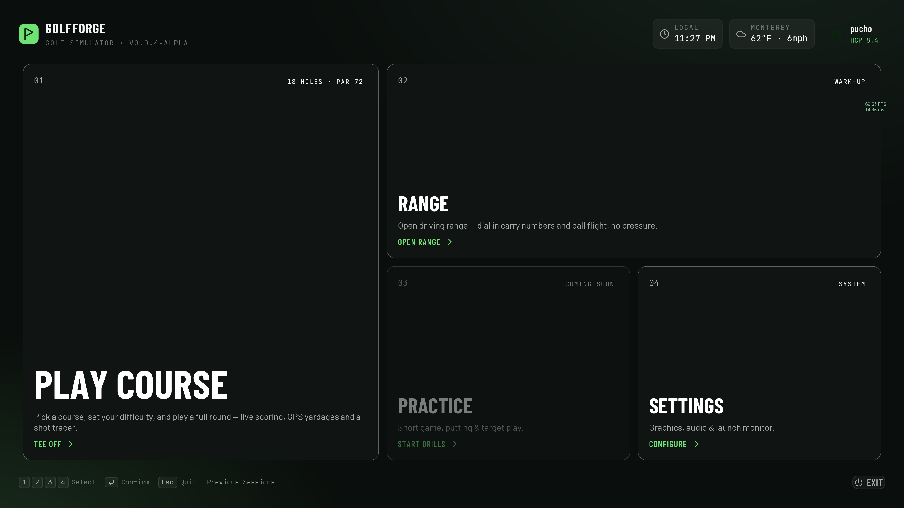
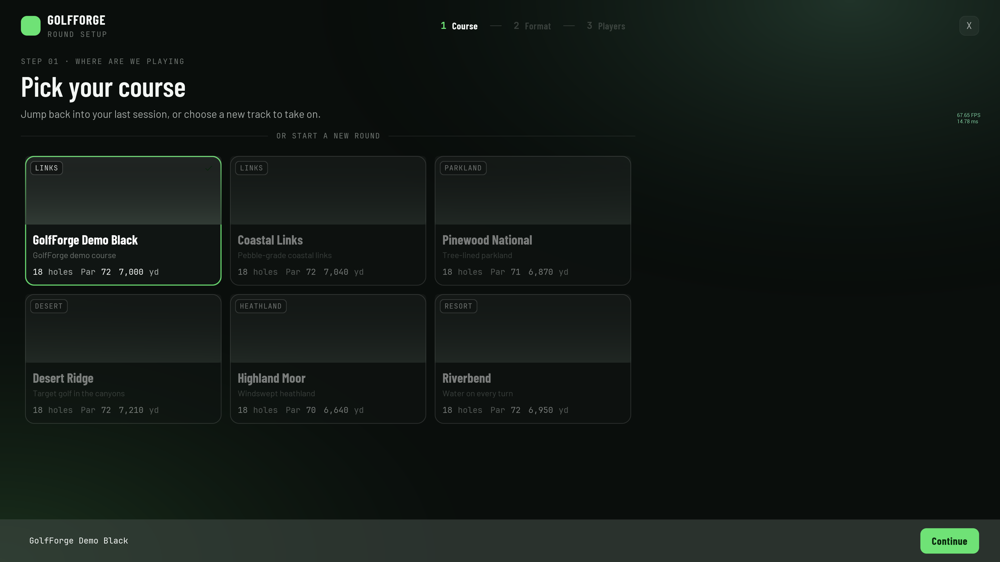
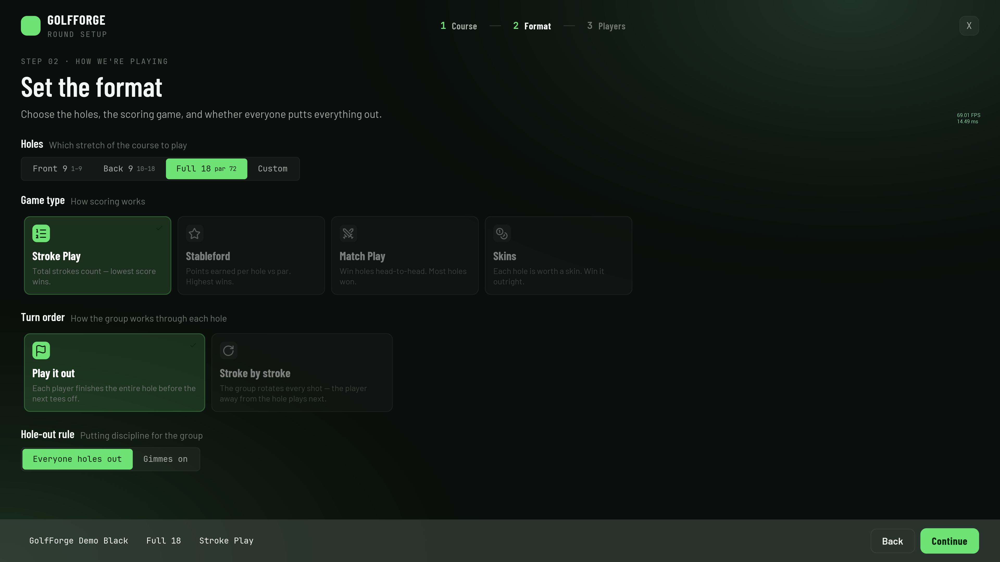
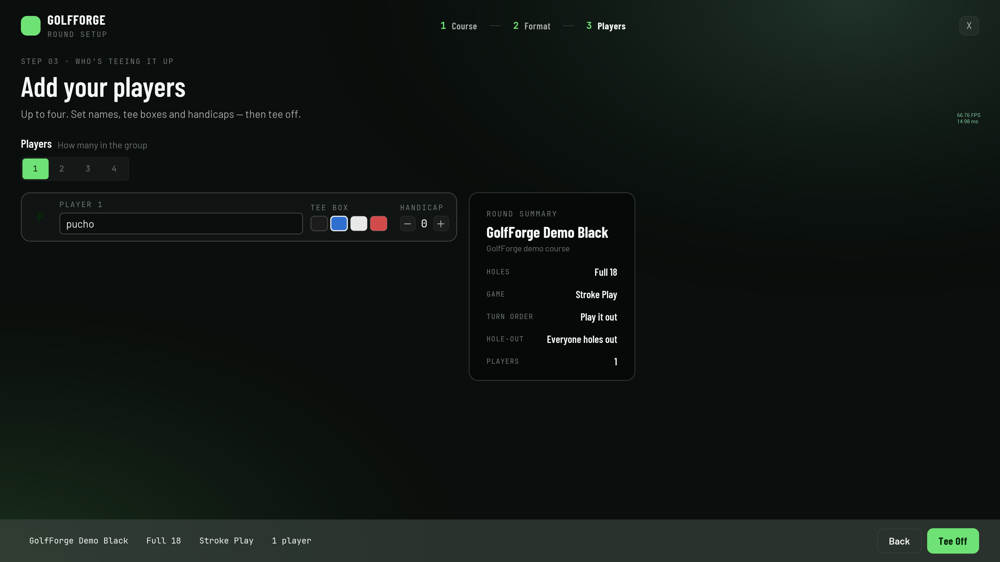
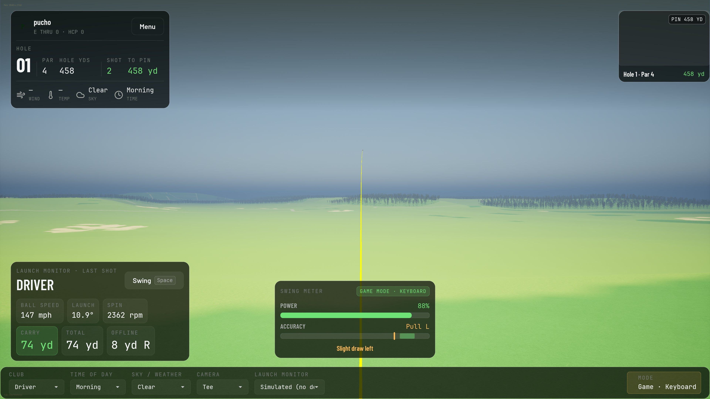
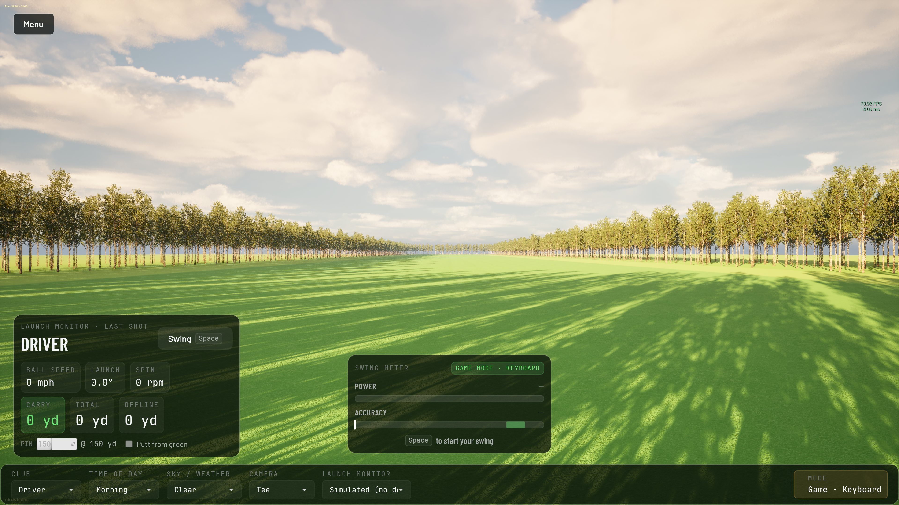
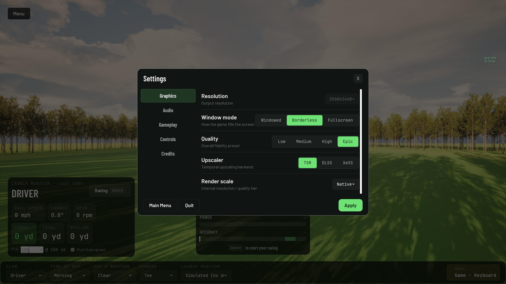

# GolfForge

Open-source, cross-platform golf simulator with AI-assisted course building, walking/treadmill
integration, and a clean BLE-based hardware story for launch monitors.

> **Status:** early, pre-1.0, and moving fast. **v0.0.4-alpha** brings a completely rebuilt UI — a themed main menu, a guided round-setup flow (course → format → players, with game types, handicaps and tee boxes), a glass in-round HUD with a live hole map and conditions strip, and an end-of-round scorecard. You can play a full **18-hole single-player round on a real LIDAR-cooked course with just a keyboard** — no launch monitor required. The practice range still runs, OpenFlight drives it, and OpenStreetMap + USGS feed the course pipeline. Expect rough edges.
>
> _The repository is still named `golfsim` while the rename to GolfForge is in progress._

## Why

Three structural weaknesses in the closed-source sim-golf market that an open-source project can
attack:

1. **Course pipeline lock-in.** The community builds the courses; closed platforms charge for access.
   GolfForge makes the pipeline ~10x cheaper using open LIDAR + OpenStreetMap + AI-assisted UE5 import.
2. **A walking tier nobody else ships.** Wire the sim to a treadmill over Bluetooth FTMS and golf-sim
   sessions add a fitness layer — the same idea Zwift uses for cycling, applied to golf. Sit-down play
   stays a first-class option; walking is the new mode.
3. **Closed platforms.** Built on Unreal Engine 5 with real cross-platform targets (Windows / Mac /
   Linux desktop, iPad as a future tier) and no hardware gated behind a single OS.

## Try it

Pre-built packages are attached to the latest [GitHub Release](https://github.com/GolfForge/golfforge/releases). v0.0.4-alpha ships with two playable surfaces:

- **Single-player round** — main menu → **Play Course** → a guided round-setup flow (pick the course, set the format — game type, holes, turn order — and add up to four players with names, tee boxes and handicaps) → land on hole 1's tee → swing through 18 holes on a real LIDAR-cooked course. A glass HUD tracks your score, distance to pin and conditions; a scorecard caps the round. No launch monitor needed; the built-in keyboard swing meter handles it.
- **Practice range** — fixed-distance pin, full 14-club bag, launch-monitor support via [OpenFlight](https://github.com/jewbetcha/openflight) (Doppler radar) or manual-shot dialog for hardware-free testing.



Round setup is a three-step wizard — pick the course, set the format, add your players:







Then you're on the course:







### Windows

1. Download the Windows build (`GolfForge-windows-x64-*.zip`) from the latest release, extract anywhere.
2. Run `GolfForge.exe`.
3. **Windows SmartScreen will warn "Unrecognized app."** Click **More info** → **Run anyway.** The binary is unsigned (proper code-signing is on the roadmap); it's safe — verify the SHA-256 on the release page if you want belt-and-suspenders.

### macOS (Apple Silicon)

1. Download `GolfForge-macos-arm64.zip` from the latest release, extract to your `Applications` folder (or anywhere).
2. **One-time Terminal command** to bypass macOS Gatekeeper (the app is unsigned for v1 — Apple Developer Program enrollment is on the roadmap):
   ```bash
   xattr -dr com.apple.quarantine /Applications/GolfForge.app
   ```
   (Adjust the path if you extracted elsewhere.) After this runs once, the app launches normally forever.
3. Open `GolfForge.app`.

### Linux

Not yet packaged. Build from source — instructions TBD.

### What you need to actually play

**Nothing.** The keyboard swing meter (Virtua-Tennis-style power → accuracy bars, Space to time each phase) drives both the course round and range Game mode. Three difficulty profiles (Easy / Normal / Pro) tune the timing window.

Optional, for the simulator-grade experience:

- A **launch monitor** that speaks our driver protocol. Today: [OpenFlight](https://github.com/jewbetcha/openflight) (DIY, ~$800 in parts, Doppler radar). More to follow.
- A **treadmill** broadcasting Bluetooth FTMS, for the walking tier — coming soon.

## Coming soon

In rough priority order:

- **Practice modes.** Closest-to-the-pin with configurable distance range; TopGolf-style islands practice map; putting drills.
- **Local multiplayer.** Stroke play with 2–4 humans on the same machine; future online peer-to-peer.
- **More real-world courses.** The first cooked course (GolfForge Demo Black) is one shipped track; the pipeline can produce others — add yours via the [course pipeline](pipeline/README.md).
- **Course-quality polish.** Bunker geometry (raised lip + depression), fairway mowing patterns (stripes / criss-cross / diagonal), course-side lighting bake.
- **Walking integration.** Bluetooth FTMS treadmill driver (build-it-yourself ESP32 reference design or any FTMS-compliant treadmill); compressed walk mode; eventual incline-matching from hole elevation profiles.
- **More launch monitors.** Square Omni driver alongside OpenFlight; other consumer LMs as the community brings them.
- **Mac/iPadOS GPU acceleration.** MetalFX upscaling for Apple Silicon (currently TSR-only).
- **Cross-platform pipeline.** Make the Python course pipeline work on Windows (Mac/Linux already supported).

## Architecture in one paragraph

Each platform target ships as a **single monolithic binary** containing the sim, the renderer, and
the platform-appropriate hardware drivers (CoreBluetooth on Apple, Windows.Devices.Bluetooth on
Windows, BlueZ on Linux). Drivers and sim communicate via an **in-process normalized event bus** —
every hardware source (launch monitor, walking sensor, manual input) publishes events of the same
shape, and the sim subscribes. Multiplayer is that same event shape over the network between peers
running the same binary. See [`docs/event-protocol.md`](docs/event-protocol.md).

## Hardware

GolfForge talks to launch monitors through a pluggable driver framework; the sim only ever sees a
normalized shot event, never the device. The first supported monitor is the open-source **OpenFlight**
DIY Doppler-radar launch monitor (over a local socket). A built-in manual-shot dialog lets you play
with no hardware at all. Walking/treadmill support over BLE FTMS is on the roadmap.

## Repo layout

```
.
├── docs/         # plan, event protocol, data contract, setup, engine cookbook
├── pipeline/     # Python course-building pipeline (LIDAR + OSM -> UE5 import PNGs)
├── engine/       # the Unreal Engine 5 project
└── courses/      # processed heightmap/splatmap outputs per course (LFS-tracked)
```

## Getting started

**Requirements:** the engine builds against **Unreal Engine 5.7**, which requires an Epic Games
account and acceptance of the [Unreal Engine EULA](https://www.unrealengine.com/eula). Some
ground/tree assets are fetched per-machine from Fab — see [`docs/ue5-cookbook.md`](docs/ue5-cookbook.md).

### Engine (Windows)

See [`docs/windows-setup.md`](docs/windows-setup.md) for the full setup — prerequisites, clone, UE5
project, and first run.

### Course pipeline (Python)

```
cd pipeline
./setup.sh           # Mac/Linux today; Windows support in progress
source .venv/bin/activate
./example.sh
```

See [`pipeline/README.md`](pipeline/README.md). Architecture and design notes live in
[`docs/`](docs/) and [`CLAUDE.md`](CLAUDE.md).

## Contributing

Bug reports and feature requests are very welcome via [Issues](../../issues). **We are not accepting
external pull requests yet** — a Contributor License Agreement needs to land first so the project can
keep its dual license. See [`CONTRIBUTING.md`](CONTRIBUTING.md) and the
[Code of Conduct](CODE_OF_CONDUCT.md). Please report security issues privately per
[`SECURITY.md`](SECURITY.md).

## Acknowledgements

GolfForge builds on excellent open-source work:

- **Launch-monitor connectors.** GolfForge speaks the **GSPro Open Connect** protocol as a server, so the
  community's connector ecosystem works with it directly — no GSPro subscription required. Special thanks
  to **[@brentyates](https://github.com/brentyates)** and the
  [squaregolf-connector](https://github.com/brentyates/squaregolf-connector) (MIT), the first connector
  validated end-to-end against GolfForge, and to the broader projects we interoperate with:
  [springbok/MLM2PRO-GSPro-Connector](https://github.com/springbok/MLM2PRO-GSPro-Connector) (Rapsodo
  MLM2PRO, FlightScope Mevo+), [OpenSkyPlus2](https://github.com/OpenSkyPlus2/OpenSkyPlus2) (SkyTrak),
  [travislang/gspro-garmin-connect-v2](https://github.com/travislang/gspro-garmin-connect-v2) (Garmin
  Approach R10), and [matthew-johnston/gspro-gc2-connector](https://github.com/matthew-johnston/gspro-gc2-connector)
  (Foresight GC2). GolfForge talks to these as separate processes over the open protocol — their source
  is not vendored.
- **[OpenFlight](https://github.com/jewbetcha/openflight)** — the open-source DIY Doppler-radar launch
  monitor and GolfForge's first launch-monitor driver.
- **[Unreal Claude MCP](https://github.com/NAJEMWEHBE/UnrealClaudeMCP)** (MIT) — the UE5 ↔ MCP
  editor-automation bridge that has been central to our AI-assisted development and testing workflow.

## License

GolfForge is dual-licensed:

- **[GNU AGPL-3.0](LICENSE)** — free and open source. Use, modify, and distribute under the AGPL,
  including its network-use/copyleft terms (derivatives and networked deployments must make their
  source available).
- **Commercial license** — for closed-source/proprietary use that can't comply with the AGPL. See
  [`COMMERCIAL.md`](COMMERCIAL.md).

Copyright (c) 2026 GolfForge contributors. The Unreal Engine is © Epic Games and used under the
Unreal Engine EULA — it is not part of this project's license.

## Data attribution

Course data is derived from open sources — **© OpenStreetMap contributors** (ODbL) and public-domain
USGS / SRTM elevation. Full details and obligations: [`ATTRIBUTION.md`](ATTRIBUTION.md).
