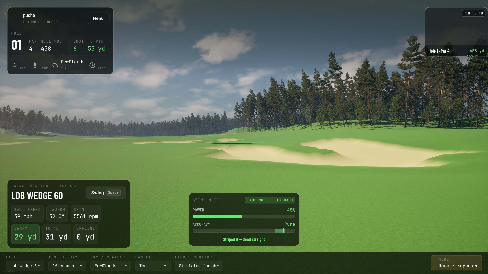
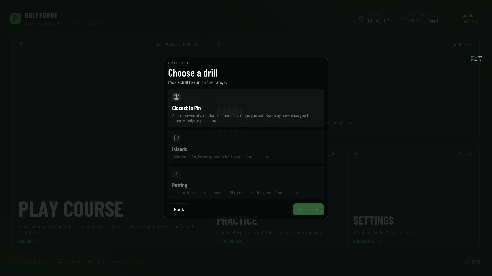
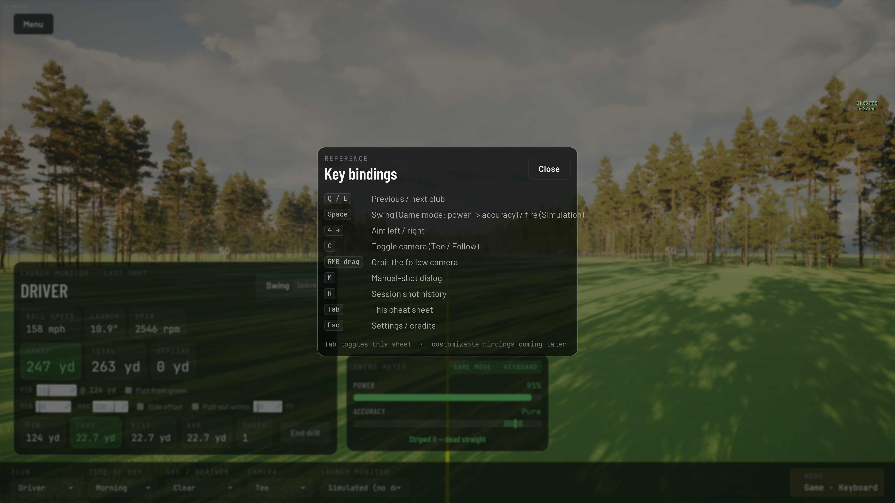

# GolfForge

Open-source, cross-platform golf simulator with AI-assisted course building, walking/treadmill
integration, and a clean BLE-based hardware story for launch monitors.

> **Status:** early, pre-1.0, and moving fast. **v0.0.6-alpha** adds a **closest-to-pin practice mode** — open **Practice** from the menu, pick a drill, and a pin spawns at a random distance for you to attack; each shot is scored by how close you finish (this shot, session best and average), with an optional putt-out. It also lands **real bunkers** — sculpted sand with a depressed floor and a raised lip, cooked from the course terrain. These sit on top of v0.0.5's **art facelift** (distinct mown turf with mowing stripes, pond water, a mixed-species tree line, golden-hour atmosphere, ambient birdsong, a fluttering branded pin flag, a dimpled ball, and a textured target green) and **GSPro Open Connect** launch-monitor support — bring your own monitor over its connector, **no GSPro subscription required** (Square Omni validated; more connectors in progress). You can still play a full **18-hole single-player round on a real LIDAR-cooked course with just a keyboard**. Expect rough edges.

## Why

Three structural weaknesses in the closed-source sim-golf market that an open-source project can
attack:

1. **Course pipeline lock-in.** The community builds the courses; closed platforms charge for access.
   GolfForge makes the pipeline ~10x cheaper using open LIDAR + OpenStreetMap + AI-assisted UE5 import.
2. **A walking tier nobody else ships.** Wire the sim to a treadmill over Bluetooth FTMS and golf-sim
   sessions add a fitness layer — the same idea Zwift uses for cycling, applied to golf. Sit-down play
   stays a first-class option; walking is the new mode.
3. **Closed platforms.** Built on Unreal Engine 5 with real cross-platform targets (Windows / Mac /
   Linux desktop, iPad as a future tier) and no hardware gated behind a single OS.

## Try it

Pre-built packages are attached to the latest [GitHub Release](https://github.com/GolfForge/golfforge/releases). v0.0.6-alpha ships with three ways to play:

- **Single-player round** — main menu → **Play Course** → a guided round-setup flow (pick the course, choose how many holes — full 18, front/back 9, or a custom set — and the hole-out rule) → land on hole 1's tee → play stroke play on a real LIDAR-cooked course. A glass HUD tracks your score, distance to pin and conditions; a scorecard caps the round. No launch monitor needed; the built-in keyboard swing meter handles it. _(The setup wizard also lays out game types, multiple players, handicaps and tee boxes, but those aren't wired into play yet — today's round is one player, stroke play. See [Coming soon](#coming-soon).)_
- **Practice range** — fixed-distance target green with collar/flag, full 14-club bag, a moving pin, and launch-monitor support via [OpenFlight](https://github.com/jewbetcha/openflight) (Doppler radar), the **GSPro Open Connect** connectors (use your own launch monitor — see below), or a manual-shot dialog for hardware-free testing.
- **Practice drills** — a **closest-to-pin** mode that gives the range a goal: open **Practice** from the main menu, pick a drill, and a pin spawns at a random distance (within a range you set, optionally offset left/right). Hit your shot and it's scored by distance from the pin — this shot, session best and average — with an optional putt-out. Islands and putting drills are stubbed in for later.


Round setup is a three-step wizard — pick the course, set the format, add your players:


Then you're on the course:


Courses carry **real bunkers** — sculpted sand with a depressed floor and a raised lip, cooked straight from the LIDAR terrain:




Practice mode turns range balls into a game — pick a drill and chase the pin:



A Tab cheat sheet lists the keyboard controls at any time:




### Windows

1. Download the Windows build (`GolfForge-windows-x64-*.zip`) from the latest release, extract anywhere.
2. Run `GolfForge.exe`.
3. **Windows SmartScreen will warn "Unrecognized app."** Click **More info** → **Run anyway.** The binary is unsigned (proper code-signing is on the roadmap); it's safe — verify the SHA-256 on the release page if you want belt-and-suspenders.

### macOS (Apple Silicon)

1. Download `GolfForge-macos-arm64.zip` from the latest release, extract to your `Applications` folder (or anywhere).
2. **One-time Terminal command** to bypass macOS Gatekeeper (the app is unsigned for v1 — Apple Developer Program enrollment is on the roadmap):
   ```bash
   xattr -dr com.apple.quarantine /Applications/GolfForge.app
   ```
   (Adjust the path if you extracted elsewhere.) After this runs once, the app launches normally forever.
3. Open `GolfForge.app`.

### Linux

Not yet packaged. Build from source — instructions TBD.

### What you need to actually play

**Nothing.** The keyboard swing meter (Virtua-Tennis-style power → accuracy bars, Space to time each phase) drives both the course round and range Game mode. Three difficulty profiles (Easy / Normal / Pro) tune the timing window.

Optional, for the simulator-grade experience:

- A **launch monitor** over its **GSPro Open Connect** connector — **no GSPro subscription required.** The Square Omni (via the [squaregolf connector](https://github.com/brentyates/squaregolf-connector)) is validated end-to-end today; other community connectors speak the same protocol and are being brought up. Or build the DIY [OpenFlight](https://github.com/jewbetcha/openflight) Doppler radar (~$800 in parts), which has a native driver. See [`docs/launch-monitors.md`](docs/launch-monitors.md).
- A **treadmill** broadcasting Bluetooth FTMS, for the walking tier — coming soon.

## Coming soon

In rough priority order:

- **Practice modes.** Closest-to-the-pin (configurable distance range, optional putt-out) **shipped in v0.0.6**; still to come — a TopGolf-style islands practice map and putting drills.
- **Local multiplayer.** Stroke play with 2–4 humans on the same machine; future online peer-to-peer.
- **More real-world courses.** Five cooked tracks ship today (GolfForge Demo Black / Blue / Red / Green / Yellow); the pipeline can produce others — add yours via the [course pipeline](pipeline/README.md).
- **Course-quality polish.** Course-side lighting bake, 3D grass, night/low-light presets, water caustics. (Bunkers with a depressed floor + raised lip landed in v0.0.6; mowing stripes, distinct mown surfaces, pond water, mixed-species trees and golden-hour atmosphere in v0.0.5.)
- **Walking integration.** Bluetooth FTMS treadmill driver (build-it-yourself ESP32 reference design or any FTMS-compliant treadmill); compressed walk mode; eventual incline-matching from hole elevation profiles.
- **More launch monitors.** Bringing up more GSPro Open Connect connectors against GolfForge (Square Omni confirmed so far; others in progress), plus native drivers for auth-gated devices (Rapsodo R50, Foresight Launch Pro, GCQuad).
- **Mac/iPadOS GPU acceleration.** MetalFX upscaling for Apple Silicon (currently TSR-only).
- **Cross-platform pipeline.** Make the Python course pipeline work on Windows (Mac/Linux already supported).

## Architecture in one paragraph

Each platform target ships as a **single monolithic binary** containing the sim, the renderer, and
the platform-appropriate hardware drivers (CoreBluetooth on Apple, Windows.Devices.Bluetooth on
Windows, BlueZ on Linux). Drivers and sim communicate via an **in-process normalized event bus** —
every hardware source (launch monitor, walking sensor, manual input) publishes events of the same
shape, and the sim subscribes. Multiplayer is that same event shape over the network between peers
running the same binary. See [`docs/event-protocol.md`](docs/event-protocol.md).

## Hardware

GolfForge talks to launch monitors through a pluggable driver framework; the sim only ever sees a
normalized shot event, never the device. It speaks the open **GSPro Open Connect** protocol as a server,
so the community launch-monitor connectors can talk to it directly — **use your existing connector, no GSPro
subscription required.** The Square Omni is validated end-to-end today (via the squaregolf connector); other
community connectors speak the same protocol and are being brought up. The DIY **OpenFlight** radar has a native driver, and a manual-shot
dialog + keyboard swing let you play with no hardware at all. Walking/treadmill support over BLE FTMS is on
the roadmap.

**→ Setup guide: [`docs/launch-monitors.md`](docs/launch-monitors.md)** — which connector to install, how
to point it at GolfForge, and the connection order that matters.

## Repo layout

```
.
├── docs/         # plan, event protocol, data contract, setup, engine cookbook
├── pipeline/     # Python course-building pipeline (LIDAR + OSM -> UE5 import PNGs)
├── engine/       # the Unreal Engine 5 project
└── courses/      # processed heightmap/splatmap outputs per course (LFS-tracked)
```

## Getting started

**Requirements:** the engine builds against **Unreal Engine 5.7**, which requires an Epic Games
account and acceptance of the [Unreal Engine EULA](https://www.unrealengine.com/eula). Some
ground/tree assets are fetched per-machine from Fab — see [`docs/ue5-cookbook.md`](docs/ue5-cookbook.md).

### Engine (Windows)

See [`docs/windows-setup.md`](docs/windows-setup.md) for the full setup — prerequisites, clone, UE5
project, and first run.

### Course pipeline (Python)

```
cd pipeline
./setup.sh           # Mac/Linux today; Windows support in progress
source .venv/bin/activate
./example.sh
```

See [`pipeline/README.md`](pipeline/README.md). Architecture and design notes live in
[`docs/`](docs/) and [`CLAUDE.md`](CLAUDE.md).

## Contributing

Bug reports and feature requests are very welcome via [Issues](../../issues). **We are not accepting
external pull requests yet** while the foundations settle (a stability pause, not a licensing one).
When PRs open, contributions will be under the project's AGPL-3.0 license with a
[Developer Certificate of Origin](https://developercertificate.org/) sign-off (`git commit -s`) — no
CLA. See [`CONTRIBUTING.md`](CONTRIBUTING.md) and the [Code of Conduct](CODE_OF_CONDUCT.md). Please
report security issues privately per [`SECURITY.md`](SECURITY.md).

## Acknowledgements

GolfForge builds on excellent open-source work:

- **Launch-monitor connectors.** GolfForge speaks the **GSPro Open Connect** protocol as a server, so
  community connectors can talk to it directly — no GSPro subscription required. Special thanks to
  **[@brentyates](https://github.com/brentyates)** and the
  [squaregolf-connector](https://github.com/brentyates/squaregolf-connector) (MIT), the first connector
  validated end-to-end against GolfForge. GolfForge talks to GSPro Open Connect connectors as separate
  processes over the open protocol (their source is not vendored); bringing up the broader community
  ecosystem is ongoing.
- **[OpenFlight](https://github.com/jewbetcha/openflight)** — the open-source DIY Doppler-radar launch
  monitor and GolfForge's first launch-monitor driver.
- **[Unreal Claude MCP](https://github.com/NAJEMWEHBE/UnrealClaudeMCP)** (MIT) — the UE5 ↔ MCP
  editor-automation bridge that has been central to our AI-assisted development and testing workflow.

## License

GolfForge is licensed under the **[GNU AGPL-3.0](LICENSE)** — free and open source, full stop. Use,
modify, and distribute it under the AGPL, including its network-use/copyleft terms: derivatives and
networked deployments (multiplayer or hosted servers) must make their complete corresponding source
available under the AGPL. There is **no** separate commercial license — GolfForge is committed to
staying open.

Copyright (c) 2026 GolfForge contributors. The Unreal Engine is © Epic Games and used under the
Unreal Engine EULA — it is not part of this project's license.

## Data attribution

Course data is derived from open sources — **© OpenStreetMap contributors** (ODbL) and public-domain
USGS / SRTM elevation. Full details and obligations: [`ATTRIBUTION.md`](ATTRIBUTION.md).
